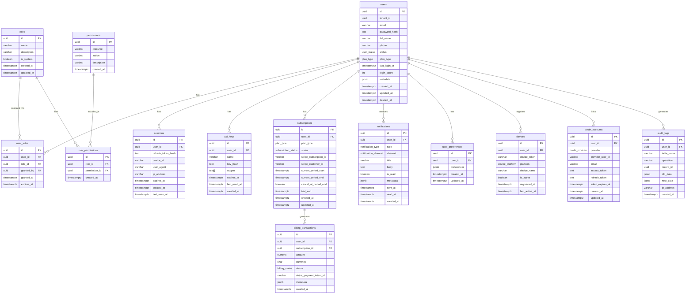
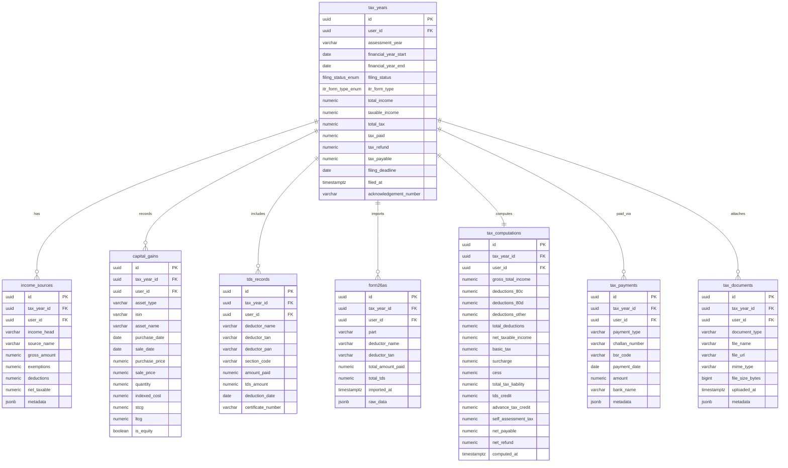
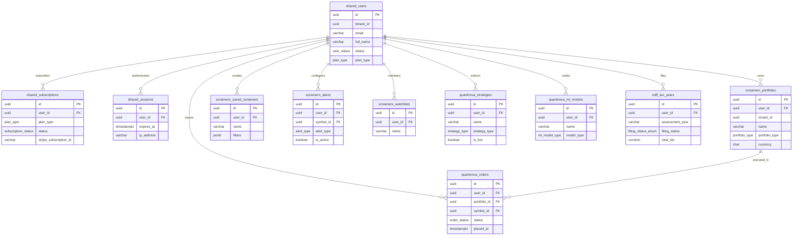

# Entity-Relationship Diagrams

All diagrams use [Mermaid](https://mermaid.js.org/) `erDiagram` syntax and can be rendered in GitHub, GitLab, Notion, and any Mermaid-compatible viewer.

## Table of Contents

- [Shared Domain ER](#shared-domain-er)
- [ScreenerX Domain ER](#screenerx-domain-er)
- [QuantNova Domain ER](#quantnova-domain-er)
- [NDFL Domain ER](#ndfl-domain-er)
- [Cross-Domain ER](#cross-domain-er)

---

## Shared Domain ER

The `shared` schema provides cross-project identity, authentication, billing, and notifications. Every other schema references `shared.users`.

---

## ScreenerX Domain ER

The `screenerx` schema is the largest domain with 47 tables covering markets, fundamentals, screener engine, portfolios, watchlists, alerts, and analytics.

```mermaid
erDiagram
    exchanges {
        uuid id PK
        varchar code
        varchar name
        char country
        char currency
        varchar timezone
        jsonb trading_hours
        boolean is_active
    }

    symbols {
        uuid id PK
        uuid exchange_id FK
        varchar ticker
        varchar name
        varchar isin
        instrument_type instrument_type
        varchar sector
        varchar market_cap_category
        boolean is_active
        date listing_date
    }

    instrument_master {
        uuid id PK
        uuid symbol_id FK
        numeric lot_size
        numeric tick_size
        numeric face_value
        numeric market_cap
        int total_shares
        date last_updated
    }

    market_data_ticks {
        uuid symbol_id FK
        timestamptz timestamp
        numeric price
        bigint volume
        numeric bid
        numeric ask
        bigint bid_size
        bigint ask_size
    }

    market_data_ohlcv {
        uuid symbol_id FK
        timestamptz timestamp
        varchar timeframe
        numeric open
        numeric high
        numeric low
        numeric close
        bigint volume
        numeric vwap
    }

    order_books {
        uuid symbol_id FK
        timestamptz timestamp
        order_book_side side
        numeric price
        bigint quantity
        int num_orders
    }

    corporate_actions {
        uuid id PK
        uuid symbol_id FK
        corporate_action_type action_type
        date ex_date
        date record_date
        date pay_date
        jsonb details
    }

    dividends {
        uuid id PK
        uuid symbol_id FK
        uuid corporate_action_id FK
        dividend_type dividend_type
        numeric amount_per_share
        date ex_date
        date pay_date
    }

    splits {
        uuid id PK
        uuid symbol_id FK
        uuid corporate_action_id FK
        numeric split_ratio
        date ex_date
    }

    earnings {
        uuid id PK
        uuid symbol_id FK
        period_type period
        varchar fiscal_year
        date announcement_date
        numeric revenue
        numeric net_profit
        numeric eps
        numeric eps_estimate
    }

    economic_events {
        uuid id PK
        varchar name
        varchar country
        event_importance importance
        timestamptz event_time
        varchar actual
        varchar forecast
        varchar previous
    }

    news_articles {
        uuid id PK
        varchar headline
        text body
        varchar source
        text[] symbol_tickers
        sentiment_label sentiment
        timestamptz published_at
        text url
    }

    sentiment_data {
        uuid id PK
        uuid symbol_id FK
        timestamptz timestamp
        sentiment_source source
        sentiment_label label
        numeric score
        int sample_count
    }

    companies {
        uuid id PK
        uuid symbol_id FK
        text description
        varchar website
        varchar sector
        varchar industry
        varchar country
        varchar ceo
        int employee_count
        date founded_date
        jsonb financials_summary
    }

    balance_sheets {
        uuid id PK
        uuid symbol_id FK
        period_type period
        varchar fiscal_year
        date report_date
        numeric total_assets
        numeric total_liabilities
        numeric equity
        numeric cash
        numeric debt
    }

    income_statements {
        uuid id PK
        uuid symbol_id FK
        period_type period
        varchar fiscal_year
        date report_date
        numeric revenue
        numeric gross_profit
        numeric operating_profit
        numeric net_profit
        numeric ebitda
        numeric eps
    }

    cash_flows {
        uuid id PK
        uuid symbol_id FK
        period_type period
        varchar fiscal_year
        date report_date
        numeric operating_cf
        numeric investing_cf
        numeric financing_cf
        numeric free_cf
    }

    financial_ratios {
        uuid symbol_id FK
        date as_of_date
        numeric pe_ratio
        numeric pb_ratio
        numeric roe
        numeric roa
        numeric debt_equity
        numeric current_ratio
        numeric dividend_yield
        numeric market_cap
    }

    shareholding_patterns {
        uuid id PK
        uuid symbol_id FK
        date quarter_end
        numeric promoter_pct
        numeric fii_pct
        numeric dii_pct
        numeric public_pct
    }

    mutual_fund_holdings {
        uuid id PK
        uuid symbol_id FK
        varchar fund_name
        varchar amc
        date quarter_end
        numeric holding_pct
        bigint shares_held
    }

    institutional_holdings {
        uuid id PK
        uuid symbol_id FK
        institution_type inst_type
        varchar institution_name
        date quarter_end
        numeric holding_pct
        bigint shares_held
    }

    analyst_ratings {
        uuid id PK
        uuid symbol_id FK
        varchar analyst_firm
        analyst_rating rating
        numeric target_price
        date rating_date
        text rationale
    }

    screener_templates {
        uuid id PK
        uuid created_by FK
        varchar name
        text description
        boolean is_public
        int usage_count
        timestamptz created_at
    }

    screener_filters {
        uuid id PK
        uuid screener_id FK
        varchar field
        filter_operator operator
        jsonb value
        int sort_order
    }

    saved_screeners {
        uuid id PK
        uuid user_id FK
        uuid template_id FK
        varchar name
        jsonb filters
        boolean is_favourite
        timestamptz last_run_at
    }

    screener_results_cache {
        uuid id PK
        uuid screener_id FK
        jsonb result_symbol_ids
        int result_count
        timestamptz executed_at
        interval execution_time
    }

    screener_executions {
        uuid id PK
        uuid user_id FK
        uuid screener_id FK
        int result_count
        interval execution_ms
        timestamptz executed_at
    }

    custom_formulas {
        uuid id PK
        uuid user_id FK
        varchar name
        text expression
        varchar return_type
        boolean is_public
        timestamptz created_at
    }

    portfolios {
        uuid id PK
        uuid user_id FK
        uuid tenant_id
        varchar name
        char currency
        portfolio_type portfolio_type
        boolean is_active
        date inception_date
    }

    portfolio_positions {
        uuid id PK
        uuid portfolio_id FK
        uuid symbol_id FK
        numeric quantity
        numeric avg_cost
        numeric current_price
        numeric unrealised_pnl
        timestamptz updated_at
    }

    portfolio_transactions {
        uuid id PK
        uuid portfolio_id FK
        uuid symbol_id FK
        transaction_type txn_type
        numeric quantity
        numeric price
        numeric brokerage
        date transaction_date
    }

    portfolio_snapshots {
        uuid portfolio_id FK
        date snapshot_date
        numeric total_value
        numeric invested_value
        numeric total_pnl
        numeric day_pnl
        jsonb positions_snapshot
    }

    portfolio_performance {
        uuid portfolio_id FK
        date date
        numeric daily_return
        numeric cumulative_return
        numeric benchmark_return
        numeric alpha
        numeric beta
        numeric sharpe_ratio
    }

    watchlists {
        uuid id PK
        uuid user_id FK
        varchar name
        boolean is_default
        timestamptz created_at
    }

    watchlist_items {
        uuid id PK
        uuid watchlist_id FK
        uuid symbol_id FK
        int sort_order
        jsonb notes
        timestamptz added_at
    }

    goals {
        uuid id PK
        uuid user_id FK
        uuid portfolio_id FK
        varchar name
        goal_type goal_type
        goal_status status
        numeric target_amount
        numeric current_amount
        date target_date
        timestamptz created_at
    }

    rebalancing_rules {
        uuid id PK
        uuid portfolio_id FK
        rebalancing_rule_type rule_type
        jsonb target_weights
        numeric threshold_pct
        date next_rebalance_date
        boolean is_active
    }

    alerts {
        uuid id PK
        uuid user_id FK
        uuid symbol_id FK
        alert_type alert_type
        jsonb condition
        boolean is_active
        int cooldown_seconds
        timestamptz last_triggered_at
        timestamptz created_at
    }

    alert_events {
        uuid id PK
        uuid alert_id FK
        uuid symbol_id FK
        timestamptz triggered_at
        numeric trigger_value
        jsonb context
        boolean notification_sent
    }

    websocket_sessions {
        uuid id PK
        uuid user_id FK
        varchar connection_id
        text[] subscribed_symbols
        timestamptz connected_at
        timestamptz last_ping_at
    }

    kpi_metrics {
        uuid id PK
        date metric_date
        varchar metric_name
        numeric value
        jsonb dimensions
    }

    user_activity {
        uuid id PK
        uuid user_id FK
        varchar action
        varchar entity_type
        uuid entity_id
        jsonb metadata
        timestamptz created_at
    }

    search_logs {
        uuid id PK
        uuid user_id FK
        text query
        int result_count
        interval response_ms
        timestamptz searched_at
    }

    exchanges ||--o{ symbols : "lists"
    symbols ||--o{ instrument_master : "has"
    symbols ||--o{ market_data_ticks : "has"
    symbols ||--o{ market_data_ohlcv : "has"
    symbols ||--o{ order_books : "has"
    symbols ||--o{ corporate_actions : "has"
    symbols ||--o{ dividends : "has"
    symbols ||--o{ splits : "has"
    symbols ||--o{ earnings : "has"
    symbols ||--o{ sentiment_data : "has"
    symbols ||--o{ companies : "describes"
    symbols ||--o{ balance_sheets : "reports"
    symbols ||--o{ income_statements : "reports"
    symbols ||--o{ cash_flows : "reports"
    symbols ||--o{ financial_ratios : "has"
    symbols ||--o{ shareholding_patterns : "has"
    symbols ||--o{ mutual_fund_holdings : "tracked_in"
    symbols ||--o{ institutional_holdings : "tracked_in"
    symbols ||--o{ analyst_ratings : "has"
    symbols ||--o{ portfolio_positions : "held_in"
    symbols ||--o{ watchlist_items : "added_to"
    symbols ||--o{ alerts : "monitored_by"
    symbols ||--o{ alert_events : "triggers"
    corporate_actions ||--o{ dividends : "generates"
    corporate_actions ||--o{ splits : "generates"
    screener_templates ||--o{ screener_filters : "has"
    screener_templates ||--o{ saved_screeners : "based_on"
    saved_screeners ||--o{ screener_results_cache : "produces"
    saved_screeners ||--o{ screener_executions : "logs"
    portfolios ||--o{ portfolio_positions : "contains"
    portfolios ||--o{ portfolio_transactions : "records"
    portfolios ||--o{ portfolio_snapshots : "snapshots"
    portfolios ||--o{ portfolio_performance : "measures"
    portfolios ||--o{ goals : "funds"
    portfolios ||--o{ rebalancing_rules : "governed_by"
    watchlists ||--o{ watchlist_items : "contains"
    alerts ||--o{ alert_events : "fires"
```

---

## QuantNova Domain ER

The `quantnova` schema covers the full algorithmic trading and ML research lifecycle — 23 tables.

```mermaid
erDiagram
    brokers {
        uuid id PK
        varchar name
        varchar code
        varchar api_base_url
        boolean supports_intraday
        boolean supports_options
        boolean is_active
        jsonb config
    }

    broker_accounts {
        uuid id PK
        uuid user_id FK
        uuid broker_id FK
        account_type account_type
        varchar account_number
        boolean is_active
        numeric available_margin
        numeric used_margin
    }

    orders {
        uuid id PK
        uuid user_id FK
        uuid portfolio_id FK
        uuid broker_account_id FK
        uuid symbol_id FK
        order_type order_type
        order_side side
        numeric quantity
        numeric price
        numeric trigger_price
        product_type product_type
        order_status status
        order_validity validity
        timestamptz placed_at
        timestamptz executed_at
    }

    order_fills {
        uuid id PK
        uuid order_id FK
        numeric filled_qty
        numeric fill_price
        numeric brokerage
        numeric taxes
        timestamptz filled_at
    }

    executions {
        uuid id PK
        uuid order_id FK
        uuid broker_account_id FK
        varchar exchange_execution_id
        numeric executed_qty
        numeric executed_price
        numeric total_charges
        timestamptz executed_at
    }

    positions {
        uuid id PK
        uuid user_id FK
        uuid broker_account_id FK
        uuid symbol_id FK
        numeric net_qty
        numeric avg_price
        numeric buy_qty
        numeric sell_qty
        numeric realised_pnl
        numeric unrealised_pnl
        date position_date
    }

    risk_limits {
        uuid id PK
        uuid user_id FK
        risk_limit_type limit_type
        numeric limit_value
        breach_action on_breach
        boolean is_active
    }

    pnl_snapshots {
        uuid id PK
        uuid user_id FK
        uuid broker_account_id FK
        timestamptz timestamp
        numeric realised_pnl
        numeric unrealised_pnl
        numeric total_pnl
        numeric day_high
        numeric day_low
    }

    strategies {
        uuid id PK
        uuid user_id FK
        varchar name
        strategy_type strategy_type
        text description
        boolean is_active
        boolean is_live
        jsonb parameters
        timestamptz created_at
    }

    strategy_versions {
        uuid id PK
        uuid strategy_id FK
        int version_number
        text code_snapshot
        jsonb parameters
        varchar change_notes
        timestamptz created_at
    }

    backtests {
        uuid id PK
        uuid strategy_id FK
        uuid strategy_version_id FK
        uuid user_id FK
        date start_date
        date end_date
        backtest_status status
        numeric initial_capital
        jsonb universe
        timestamptz queued_at
        timestamptz completed_at
    }

    backtest_results {
        uuid id PK
        uuid backtest_id FK
        numeric total_return
        numeric annualised_return
        numeric sharpe_ratio
        numeric max_drawdown
        numeric win_rate
        int total_trades
        numeric profit_factor
        jsonb equity_curve
        jsonb trade_log
    }

    optimization_runs {
        uuid id PK
        uuid strategy_id FK
        uuid user_id FK
        jsonb parameter_grid
        run_status status
        uuid best_backtest_id FK
        jsonb best_parameters
        timestamptz started_at
        timestamptz completed_at
    }

    alpha_signals {
        uuid id PK
        uuid strategy_id FK
        uuid symbol_id FK
        date signal_date
        signal_type signal_type
        numeric strength
        numeric confidence
        jsonb metadata
    }

    ml_models {
        uuid id PK
        uuid user_id FK
        varchar name
        ml_model_type model_type
        text description
        boolean is_active
        timestamptz created_at
    }

    model_versions {
        uuid id PK
        uuid model_id FK
        int version_number
        varchar framework
        text model_artifact_path
        jsonb hyperparameters
        jsonb metrics
        boolean is_deployed
        timestamptz trained_at
    }

    feature_store {
        uuid id PK
        varchar name
        varchar description
        varchar data_type
        varchar computation_logic
        boolean is_active
        timestamptz created_at
    }

    feature_values {
        uuid feature_id FK
        uuid symbol_id FK
        date as_of_date
        numeric value
        jsonb metadata
    }

    training_runs {
        uuid id PK
        uuid model_id FK
        uuid model_version_id FK
        run_status status
        date training_start_date
        date training_end_date
        jsonb feature_ids
        jsonb metrics
        timestamptz started_at
        timestamptz completed_at
    }

    inference_logs {
        uuid id PK
        uuid model_version_id FK
        uuid symbol_id FK
        recommendation_type prediction
        numeric confidence
        jsonb feature_snapshot
        timestamptz predicted_at
    }

    ai_recommendations {
        uuid id PK
        uuid user_id FK
        uuid model_version_id FK
        uuid symbol_id FK
        recommendation_type recommendation
        numeric target_price
        numeric confidence
        text rationale
        timestamptz valid_until
        timestamptz created_at
    }

    drift_detection {
        uuid id PK
        uuid model_version_id FK
        drift_type drift_type
        numeric drift_score
        numeric threshold
        boolean breach_detected
        date detection_date
        timestamptz detected_at
    }

    event_store {
        uuid id PK
        varchar event_type
        uuid aggregate_id
        varchar aggregate_type
        jsonb payload
        int version
        timestamptz occurred_at
        uuid caused_by_user_id
    }

    brokers ||--o{ broker_accounts : "provides"
    broker_accounts ||--o{ orders : "routes"
    broker_accounts ||--o{ executions : "confirms"
    broker_accounts ||--o{ positions : "holds"
    broker_accounts ||--o{ pnl_snapshots : "tracks"
    orders ||--o{ order_fills : "filled_by"
    orders ||--o{ executions : "results_in"
    strategies ||--o{ strategy_versions : "versioned_in"
    strategies ||--o{ backtests : "tested_via"
    strategies ||--o{ optimization_runs : "optimised_via"
    strategies ||--o{ alpha_signals : "generates"
    backtests ||--|| backtest_results : "produces"
    optimization_runs ||--o| backtests : "best_via"
    ml_models ||--o{ model_versions : "versioned_in"
    ml_models ||--o{ ai_recommendations : "powers"
    model_versions ||--o{ training_runs : "trained_in"
    model_versions ||--o{ inference_logs : "used_in"
    model_versions ||--o{ drift_detection : "monitored_by"
    feature_store ||--o{ feature_values : "stores"
```

---

## NDFL Domain ER

The `ndfl` schema covers the Indian income tax return workflow — 8 tables.

---

## Cross-Domain ER

This diagram shows how `shared.users` is the central reference point for all project schemas. Only key tables are shown for clarity.

